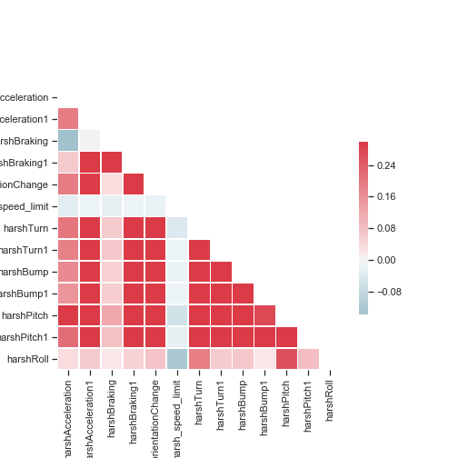
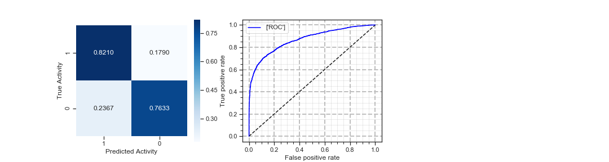

# Grab Challenge
## Intro
No one likes jerky rides, we’ve been helping our driver-partners understand how they drive so they can become better drivers.

By collecting GPS, gyroscope and accelerometer data from our app during Grab trips, we are able to provide our driver-partners with weekly telematics reports on their driving patterns like speeding, acceleration and braking, so they know where they can do better.

Problem Appears to Sequential Problem But good Feature Engineering will turn this problem to  Structure Data Problem.  

#### NOTE: This is only proof of concept, Actual Model will be implemented using Apache BEAM, will be update later in this Repo 

# Engineered Features:
Features are decided upon primarily through domain knowledge and analysis of correlation.

|Engineered Features (Datapoint):|Description: |
| -------------                  |---|
|Harsh Accleration                |Harsh Accleration is Determined from acceleometer Z axis, if the accelertion is above threshold Value in m/s2.
|Harsh Braking                   |Harsh braking is sudden Decccleration that is Determined from acceleometer Z axis,  if the accelertion is below threshold Value in m/s2
|Harsh Turns                  |Harsh Turn is Determined from acceleometer x axis, if the accelertion is above threshold Value m/s2 in Both Direction
|Harsh Bumps                   |Harsh Bumps is Determined from acceleometer y axis, if the accelertion is above threshold Value m/s2 in Both Direction
|Change in Phone Orentation                   |Change in Phone orentation is determined from the change in gyro values
|Harsh Pitch                          |Harsh Pitch is determined from difference in pitch mean value of the bookingID + pitch threshold value,  
pitch = atan2((- acceleration_x) , sqrt(acceleration_y * acceleration_y + acceleration_z * acceleration_z)) * 57.3
|Harsh Roll                          |Harsh Roll is determined from difference in roll mean value of the bookingID + roll hreshold value,  
roll = atan2(y_Buff , z_Buff) * 57.3
|Harsh Speeding(Exceding Speed Limit)                           |Speed above Treshold Values
|Distance                     |Distance based on Time * Average Speed, Distance is used to penalize the above value based on Distance of the BookingID

##### Statical Feature mean, average and std deviation were added to increase the accuracy. But didn't Help. 
##### Feature is bucketies to get more accuracy 

#### Feature Correlation Map

 <td>  </td>

|FeatureData Features (Datapoint):|Description: |
| -------------                  |---|
|Pitch                |Correlation With Acceleration, Braking and Bumps
|Roll                |Turns
|Braking                |Don't Corelate with Acceleration and correlate with Pitch 
|Phone Orientation                |Correlate with Pitch Roll, Acceleration, Braking and Turns
 Did feature bucketing To increase the accuracy. 

#### Final Model accuracy

<td>  </td>

#### Conclusion
#### Best model is gradient boosted decision tree, need more data to increase accuracy, try Deep Neural Network like LinearClassification, LinearDNNClassifier, Custom Estimators. Still we cannot increase the accuracy.
#### Even consider bucketizing the features and added second order polynomials features, still cannot increase the accuracy. I need more data to increase accuracy and prove my hypothesis.
